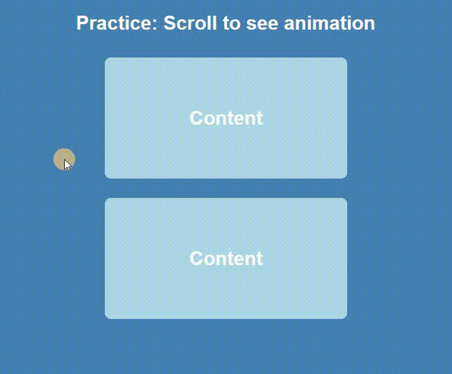

# 🛠 JS - Scroll animation

# 🔗 [Live Preview](https://633ad5fdcdd242025ce74b71--meek-froyo-a5db8a.netlify.app/)

## Welcome! 👋

- This time I practice making boxes of content sliding into the screen from both left and right to the centre using JS when scrolling down, and also disappear when scrolling up

### Languages and features 👨‍💻 

- JS: functions, IF statements, adding and removing classes.

Thanks for checking out my projects